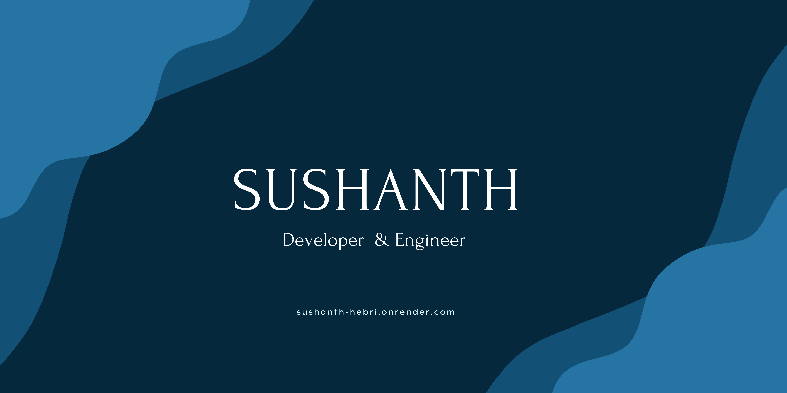

<!--  -->

  

##  Publications

- [Blindaid: Assisting the Visually Impaired in Object Detection and Tracking Using SLAM](https://theaspd.com/index.php/ijes/article/view/323)  
  *International Journal of Engineering & Science (2024)*  
  *Recognized as a Top 3 Project (2025)*  | Abstract of [paper](https://github.com/Sushanth-Hebri/Compass3.1/wiki/Paper-Abstract)

# Sushanth Hebri's GitHub

- Music & typography concept based design :  [GeoDash-fleet management](https://github.com/Sushanth-Hebri/GeoDash-Fleet_Management) 
- 🌐 Explore my portfolio: [Sushanth's Portfolio](https://sushanth-hebri.onrender.com/)

**Recent work** visit for some UI park [The space between words](https://sushanth-hebri.github.io/The-Space-Between-Words/) 

**Update:**

## Featured Projects  

| **Project Name (with Link)** | **Description** |  
|-----------------------------|---------------| 
| [The Space Between Words](https://sushanth-hebri.github.io/The-Space-Between-Words/) | Concept based story telling | 
| [GeoDash-fleet management](https://github.com/Sushanth-Hebri/GeoDash-Fleet_Management) | fleet management console |  
| [Space Cards App](https://github.com/Sushanth-Hebri/Spacecard-App-Versions-CP) | A space-themed card application featuring various versions and enhancements. |  
| [Green Real Estate](https://sushanth-hebri.github.io/Green-Estate_A_Real_Estate_Platform/) | A real estate platform demonstrating the use case of the "Green Vision API." |  
| [Mind-Chit](https://mind-chit.vercel.app) | A content-sharing application built using React.js. |  
| [Human Image Verifier](https://hebris-human-validations.onrender.com/) | A web tool for human image verification. |  
| [Rounds Storytelling Site](https://rounds.onrender.com/) | A storytelling platform for sharing interactive stories. |  
| [Group Talks Realtime](https://grouptalkk.onrender.com) | A real-time group discussion and chat application. |  
| [MERN Fully Deployed](https://sushanth-auth.onrender.com/sign-in/) | A full-stack MERN authentication system. |  
| [Hebri’s Assistant](https://sushanth-hebri.github.io/Hebri-s-Assistant---accumulated-tools-/) | A collection of accumulated tools for various tasks. |  
| [TMDB - Movie Explorer](https://sushanth-hebri.github.io/TMDB-API-INTEGRATION/) | A movie exploration tool using the TMDB API. |  
| [Visualize Songs Now](https://sushanth-hebri.github.io/Visualize-songs/) | A song visualization tool with interactive features. |  
| [VIZ MUSIC](https://sushanth-hebri.github.io/Viz-Music/) | A music search and enjoyment platform. |  

## Let's Connect:

- 💬 Ask me about: **HTML, CSS, JS, Frontend Designs, Backend Solutions, and the latest industry updates**

- 📫 Reach me at: [sushanthhebri336@gmail.com](mailto:sushanthhebri336@gmail.com)

<h3 align="center">Movie Time? Got Here</h3>

  <a href="https://sushanth-hebri.github.io/TMDB-API-INTEGRATION/">TMDB Recent Movies</a>

Feel free to explore my projects, and reach out if you have any questions or collaboration ideas. Let's create something amazing together!

<h3 align="left">Connect with me:</h3>

<h3 align="left">Languages and Tools:</h3>

         

&nbsp;

