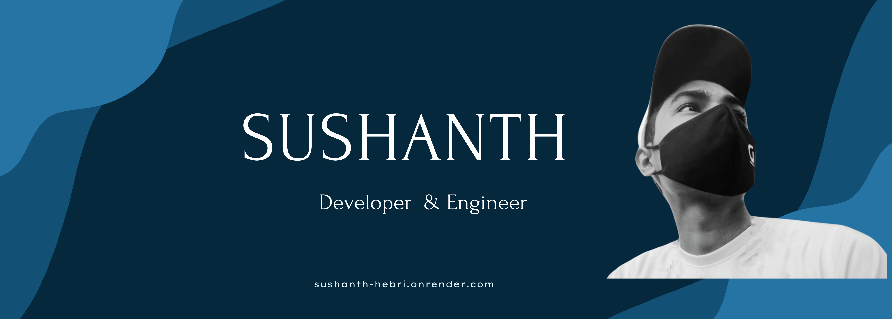

<h1 align="center">Hey 👋, I'm Sushanth</h1>
<h3 align="center">A passionate full stack developer from India</h3>

  

  

# Sushanth Hebri's GitHub

- 🔭 Successfully completed project: **Heat Beat Music Player**
- 🌐 Explore my portfolio: [Sushanth's Portfolio](https://sushanth-hebri.onrender.com/)
- 🌱 Currently expanding my knowledge in: **Flutter, ReactJs, and Python**
- 👨‍💻 Check out my latest work: [Voice Navigation Enabled Portfolio](https://sushanth-hebri.onrender.com/)

## Featured Projects:

  
   
  <a href="https://hebris-human-validations.onrender.com/">Human Image Verifier</a>

  
   
  <a href="https://rounds.onrender.com/">Rounds story telling site</a>

  
   
  <a href="https://group-talkk.onrender.com/">Group Talks realtime</a>

  
   
  <a href="https://sushanth-auth.onrender.com/sign-in/">MERN Fully Deployed</a>

  
   
  <a href="https://sushanth-hebri.github.io/TMDB-API-INTEGRATION/">TMDB - Movie Explorer</a>

  
   
  <a href="https://sushanth-hebri.github.io/Visualize-songs/">Visualize songs now</a>

## Let's Connect:

- 💬 Ask me about: **HTML, CSS, JS, Frontend Designs, Backend Solutions, and the latest industry updates**
- 📫 Reach me at: [sushanthhebri336@gmail.com](mailto:sushanthhebri336@gmail.com)

## Fun Fact:

- ⚡ Did you know? I'm currently working on building a time travel machine!

Feel free to explore my projects, and reach out if you have any questions or collaboration ideas. Let's create something amazing together!

<h3 align="left">Connect with me:</h3>

  
  
  
  

<h3 align="left">Languages and Tools:</h3>

  
  
  
  
  
  
  
  

&nbsp;

